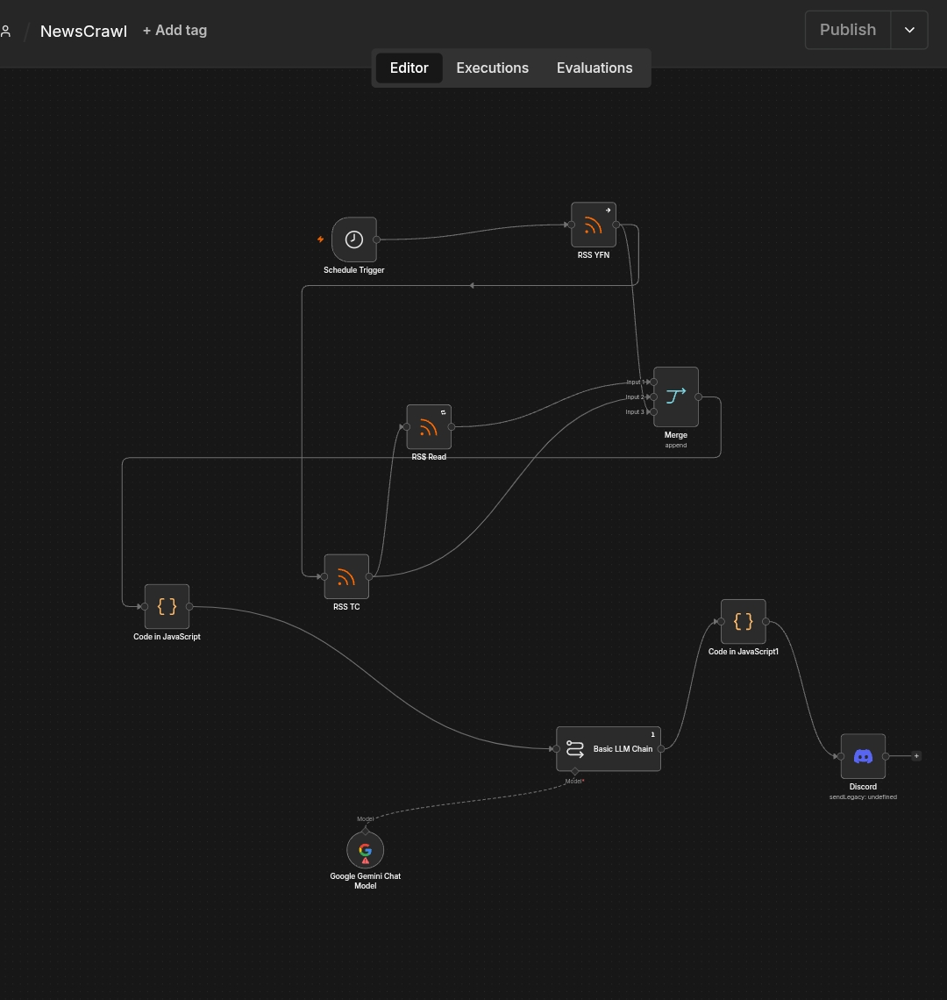

# NewsCrawl

# Autonomous Macro-Finance & Tech Intelligence Pipeline

An automated, framework-free data engineering pipeline that ingests raw macroeconomic and technological syndication feeds, orchestrates them through an array sanitation layer, normalizes the payloads using Generative AI semantic analysis, and delivers high-density, scannable terminal-style intelligence dashboards directly to Discord.

---

## 📋 System Summary

This project removes the manual overhead of monitoring global tech shifts and market updates. Built completely on a native web stack without heavy third-party runtime frameworks, the architecture utilizes serverless micro-orchestration to fetch, clean, categorize, and summarize complex unstructured news data on a scheduled cron routine. The final intelligence output is structurally optimized for mobile and desktop readability using advanced Markdown layout layers.

---

## 🚀 Key Features

* **Multi-Source Ingestion Grid:** Parallel streaming from high-signal syndication nodes including Hacker News, TechCrunch, and Yahoo Finance Commodities feeds.
* **Deterministic Quota Enforcement:** A low-overhead array processor that enforces a strict ceiling of the top 5 articles per platform to eliminate information fatigue.
* **Semantic Taxonomy Router:** Integrates Gemini LLM via targeted system prompts to map unstructured data streams into distinct analytical buckets (*Artificial Intelligence*, *Cybersecurity*, *Global Macro & Commodities*).
* **Automated Data Normalization:** Standardizes multi-source string formats, stripping HTML fragments, resolving XML entity bloating, and escaping problematic symbols natively.
* **High-Density Discord Interface:** Transforms plain text walls into an interactive dashboard using native Markdown tricks like visual anchors (`###`), metadata badges (`` ` ``), and subtext strings (`-#`).

---

## 🛠️ Technical Specifications & Architecture

### Core Engineering Stack
* **Orchestration Engine:** n8n (Self-Hosted / Cloud Ecosystem)
* **Processing Environment:** Node.js Runtime Environment
* **Data Transformation Layer:** Vanilla JavaScript (ES6+)
* **Inference Layer:** Gemini Pro Flash API Model
* **Notification Terminal:** Discord Webhooks API Layer

### System Data Pipeline Flow
[ Ingestion Grid: RSS ] ──► [ Gateway Merge Node ]
│
▼
[ JS Data Sanitation ] (Clamps to Top 5 / Source)
│
▼
[ Gemini Inference ] (Applies Taxonomy & Prompts)
│
▼
[ Discord Notification ] (Delivers Scannable UI)

## 💻 Code Architecture Highlights

### Array Isolation & Sanitation Layer
The system drops external frame libraries, utilizing a raw iterative loop to clean string tables, dynamically check origins by inspecting destination strings, and enforce explicit payload quotas:

```javascript
// Data filtering logic from the primary data cleaning step
let hnCount = 0, tcCount = 0, yahooCount = 0, displayCount = 1;

for (const item of articles) {
    let link = item.json.link || "";
    
    // Enforce high-signal volume restrictions per domain
    if (link.includes("ycombinator.com") && hnCount++ >= 5) continue;
    if (link.includes("techcrunch.com") && tcCount++ >= 5) continue;
    if (link.includes("yahoo.com")      && yahooCount++ >= 5) continue;

    // String normalization and entity scrubbing
    let cleanTitle = item.json.title.trim()
        .replace(/&amp;/g, '&')
        .replace(/&quot;/g, '"')
        .replace(/&#x27;/g, "'");
    
    // Builds consolidated context block for the downstream LLM...
```
Prompt Engineering Layer
The backend utilizes a strict, zero-filler System Prompt that forces the LLM to output consistent metadata blocks without conversational padding:
You are an elite AI technical intelligence agent. Your job is to process raw technology RSS feeds and synthesize them into a beautiful, scannable intelligence dashboard for a Discord interface.

Strict Output Layout Rules:
1. Divide the final brief into distinct taxonomy categories using clean emoji accents.
2. Separate major sections with an explicit string line: ───────────────────────────────────────
3. Output every single news item to match the high-density layout blueprint using markdown visual anchors (###) and metadata badges (`).


# Deployment & Environment Setup Guide

Follow this step-by-step guide to deploy, configure, and initialize the Autonomous Macro-Finance & Tech Intelligence Pipeline.

---

## 📋 Prerequisites

Before initializing the system, ensure you have the following accounts and access keys ready:
* **n8n Instance:** A self-hosted or cloud-hosted instance (e.g., running on Railway.app).
* **Google AI Studio Account:** Access to a Gemini API Key ([Get an API Key here](https://aistudio.google.com/)).
* **Discord Server:** Administrator or Webhook permissions on a target Discord server.

---

## ⚙️ Step 1: Import the n8n Workflow Schema

1. Open your n8n workspace dashboard.
2. In the top-right corner of the canvas workflow editor, tap the **Three Dots Menu** and select **Import from File**.
3. Select your exported workflow JSON schema file. 
4. The canvas will instantly populate with your core node network:
   `[Schedule Trigger] ──► [Merge Gateway] ──► [JS Code Node] ──► [Gemini] ──► [Discord Link]`

---

## 🔑 Step 2: Configure Gemini API Credentials

1. Locate and double-click the **Basic LLM Chain** (or **Google Gemini**) node on your canvas.
2. Under the **Credential for Google Gemini API** dropdown parameter, select **Create New Credential**.
3. Retrieve your private API Key from your Google AI Studio dashboard.
4. Paste your token into the **API Key** parameter slot within n8n and click **Save**.

---

## 🎛️ Step 3: Connect the Ingestion Grid

Verify that your source nodes are configured properly to pull down raw syndication tables cleanly:

| Node Name | Data Target Provider | Resource URL |
| :--- | :--- | :--- |
| **RSS TC** | TechCrunch | `https://techcrunch.com/feed/` |
| **RSS Read** | Hacker News | `https://news.ycombinator.com/rss` |
| **Yahoo Commodities** | Yahoo Finance | `https://finance.yahoo.com/news/category-commodities/rss` |

*Ensure each node's settings menu has **On Error: Continue (using default output)** toggled ON to avoid stopping the pipeline if one platform goes down.*

---

## 💬 Step 4: Configure the Discord Webhook Target

To push the compiled, terminal-style intelligence summaries directly into your Discord channel without third-party frameworks:

1. Open your Discord application and navigate to your target server channel settings (**Channel Settings ──► Integrations ──► Webhooks**).
2. Click **Create Webhook**, name your bot profile (e.g., `Intel Engine`), and copy the unique **Webhook URL**.
3. Return to n8n and double-click your ending **HTTP Request Node** (or dedicated **Discord Node**).
4. Paste your copied webhook endpoint directly into the **URL** configuration parameter field.
5. Set the HTTP Method to **`POST`**.
6. Map the body expression parameters so that the text field binds cleanly to the parsed output payload:
   ```json
   {
     "content": "{{ $json.text }}"
   }
```
   
